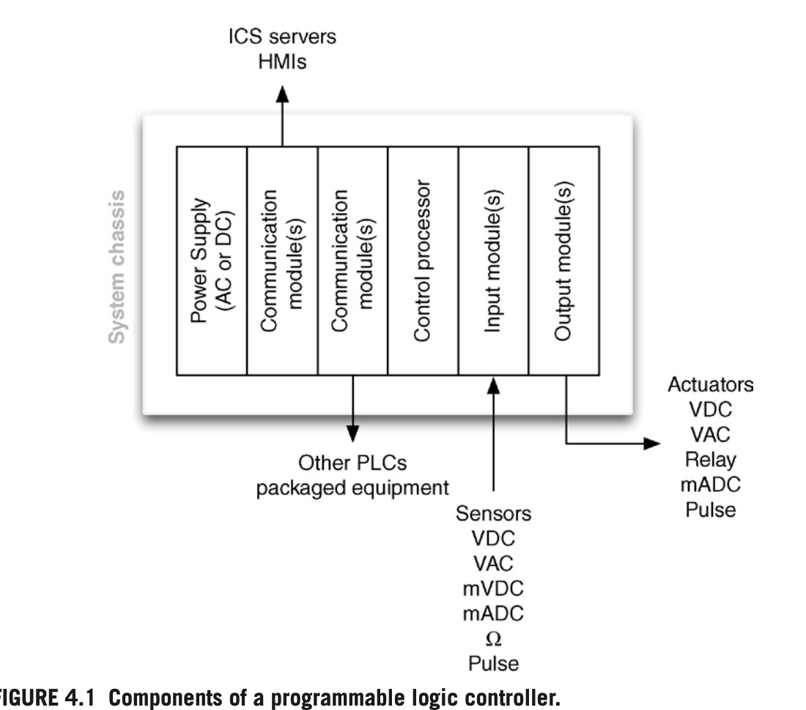
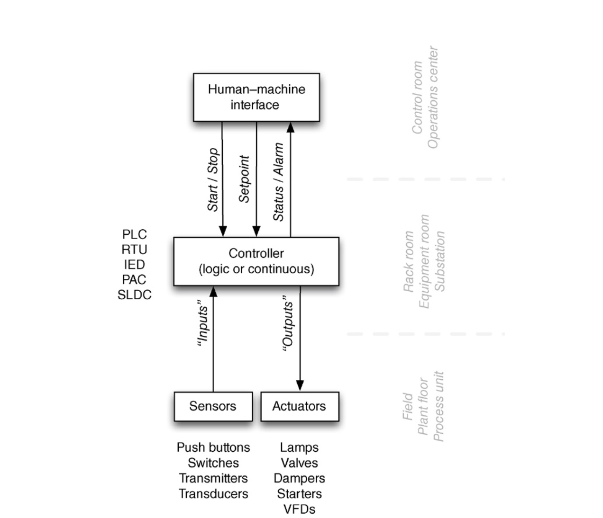
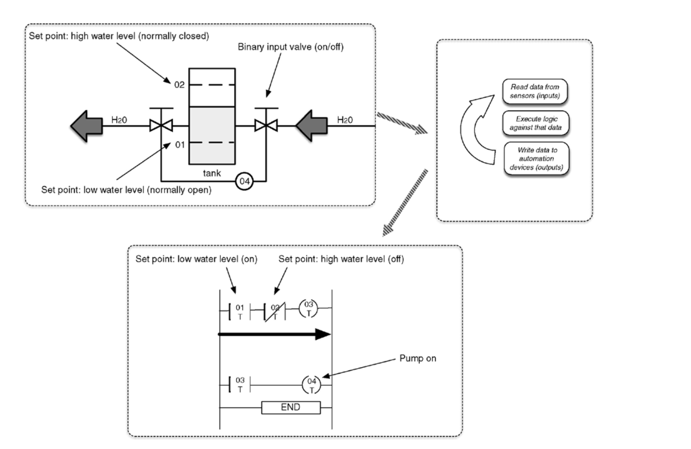
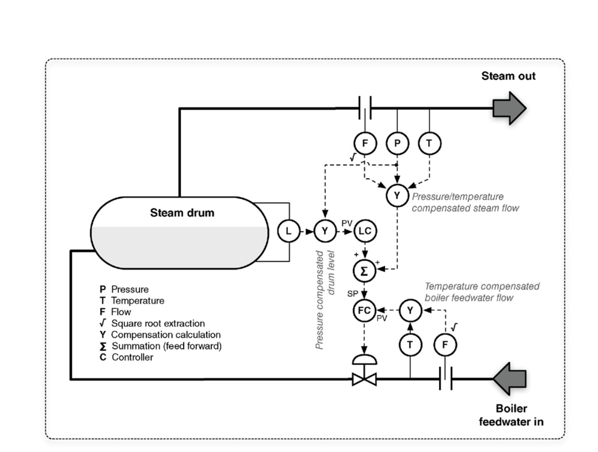
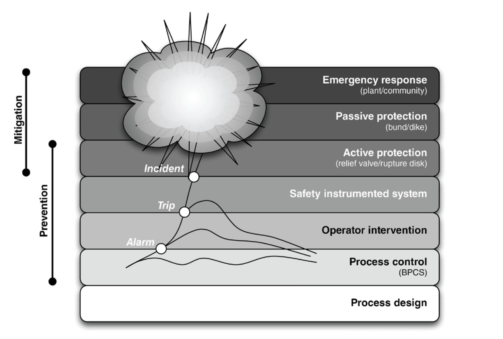
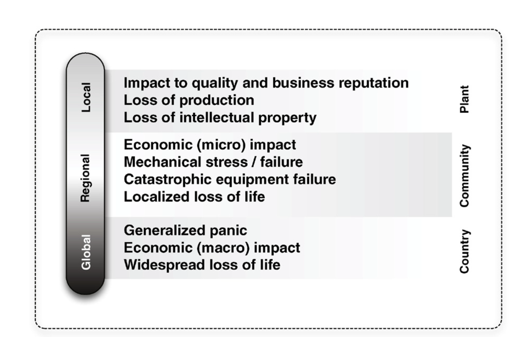

# Introduction

## Overview
A comprehensive approach to securing Industrial Control Systems (ICS), taking into account their unique network, protocol, and application characteristics. It also considers various common compliance controls to offer practical guidance on implementing security measures in industrial environments.

## Key Concepts
- **Industrial Control Systems (ICS):** A broad term used to describe various control systems, including SCADA (Supervisory Control and Data Acquisition) and DCS (Distributed Control Systems).
- **Operational Technology (OT):** 

## Purpose
To bridge the gap between general enterprise security methods and the specific needs of industrial networks by providing:
- Deployment and configuration guidance
- Explanation of why certain security controls should be implemented
- Guidance on where and how these controls should be applied and used

## Goals
- Enhance the security of industrial networks by applying tailored security controls
- Provide practical, standards-based guidance for deployment and configuration
- Help readers understand the unique security requirements of ICS environments

### ICS Components
ICS components interact within an industrial network in addition to knowledge of how industrial network protocols operate.
how control systems are connected
basic security flaws in an industrial network design

**SYSTEM ASSETS:** PLC, RTUs, IEDs, HMIs, workstations, servers, data historians, etc.

### PLC (Programmable Logic Controller)
A programmable logic controller is a specialized industrial computer used to automate functions within manufacturing facilities
PLCs were originally designed to replace electromechanical relays
control real-time processes,
plastic manufacturing, a catalyst may need to be injected into a vat when the temperature reaches a very specific value. If processing overhead or other latency introduces delay in the execution of the PLC’s logic
PLC logic programs: IEC-61131-3 standards
Language: Ladder logic, STL, FBD, Sequential Function Charts (SFC)

Protocols: PLCs can use a variety of digital and analog communications methods, but typically use a fieldbus protocol, such as Modbus, ControlNet, EtherNet/IP, PROFIBUS, PROFINET

### RTUs (Remote Terminal Units)
Remote terminal unit typically resides in a substation, along a pipeline, or some other remote location. RTUs monitor field parameters and transmit that data back to a central monitoring station—typically either a master terminal unit (MTU) that may be an ICS server, a centrally located PLC, or directly to an HMI

### IEDs (Intelligent Electronic Devices)
RTUs and PLCs are designed for general use (i.e., they can be programmed to control the speed of a motor, to engage a lock, to activate a pump, or rail crossing gate)

### HMI (Human-Machine Interface)
Human–machine interfaces are used as an operator’s means to interact with PLCs
HMI is software-based

### System Operations
Industrial network protocols, devices, and topologies discussed are used to create and automate some industrial operation: refining crude oil, manufacturing a consumer product, purifying water, generating electricity, synthesizing and combining chemicals, and so on. A typical industrial operation consists of several layers of programmed logic designed to manipulate mechanical controls in order to automate the operation. Each specific function is automated by what is commonly referred to as a control loop. Multiple control loops are typically combined or stacked together to automate larger processes.

### Control Loops
Automated processes: Needs Control over the process
these can be achieved by various types of control systems, that is programmed with specific logic.
control action is necessary in order to perform a specific function

* Closed loop: output of the process affects the inputs
* Open loop: output of the process does not affect the inputs
 and

### Control Processes
A “control process” is a general term used to define larger automated processes within an industrial operation. Many control processes may be required to manufacture a product or to generate electricity, and each control process may consist of one or many control loops.

### Feedback Loops
Every automated process relies on some degree of feedback both within a control loop and between a control loop or process and a human operator. Feedback is generally provided directly from the HMI used to control a specific process.

### Safety Instrumented Systems
Safety instrumented systems (SIS) are deployed as part of a comprehensive risk management strategy utilizing layers of protection to prevent a manufacturing environment from reaching an unsafe operating condition. The basic process control system (BPCS) is responsible for discrete and continuous control necessary to operate a process within normal operational boundaries. In the event that an abnormal situation occurs that places the processing outside of these normal limits, the SIS is provided as an automated control environment that can detect and respondto the process event and maintain or migrate it to a “safe” state—typically resulting in equipment and plant shutdowns. As a final layer of protection, manufacturing facilities utilize significant physical protective devices including relief valves, rupture disks, flare systems, governors, and so on to act as a final level of safety prior to the plant entering dangerous operating limits. These events and corresponding actions are shown in

### Network Topologies
* Bus
* Star
* Hybrid
* Ring
* Mesh

### Network Services
* IAM (Identity and Access Management): directory services, domain services, and others are required to ensure that all industrial zones have a baseline of access control in place.
* Wireless Access: Wireless networks might be required at almost any point within an industrial network, including plant networks, supervisory networks, process control networks, and field device networks.
* Remote Access: Remote access may be required for maintenance, monitoring, and control.

### Network Security Controls
Network security controls also introduce latency, typically to a greater degree than network switches and routers. This is because, as in switches and routers, every frame of network traffic must be read and parsed to a certain depth, in order to make decisions based upon the information available in Ethernet frame headers, IP packets headers, and payloads.
Hacking Industrial Control systems: Industrial networks are responsible for continuous and batch processing and other manufacturing operations.
Consequences: 

### Common Attacking Surfaces
* Access Control
* Analyzers Management System
* Application Servers
* Assets management systems
* Controllers: (PLC, RTUs, MTUs)
* Users: (ICS engineers, plant operators, technicians)

### Common Attack Methods
* MitM (Man-in-the-Middle) Attacks: An attacker intercepts communication between devices
* DoS (Denial-of-Service) Attacks: An attacker floods a system with traffic to make it unavailable
* Replay Attacks: An attacker captures and retransmits legitimate traffic to manipulate industrial protocols

### Sophisticated Attacks
* Spear Phishing: Targeted phishing attacks to access systems behind a firewall that would drop a remote access toolkit (RAT), and then obtain the credentials needed to access the trusted industrial networks, where targets may be compromised or exploited further.

### Industrial Cyber Threats
* 1982: First recorded ICS incident (Siberian pipeline sabotage).
* 2007: Stuxnet worm discovered, targeting Iran's nuclear facilities.
* 2013: Target data breach via compromised HVAC contractor.
* 2015: Ukrainian power grid attack causing widespread outages.
* 2017: WannaCry ransomware affects global industrial operations.
* 2021: Colonial Pipeline ransomware attack disrupts fuel supply.